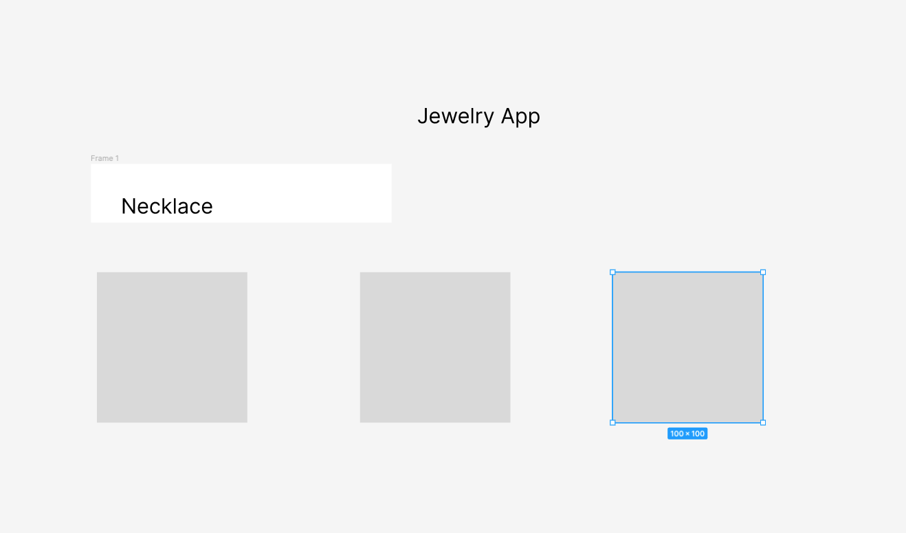

## Project description

I want to create an e-commerce app for small jewelry business owners. Users required to sign in before browsing website

## User Stories

* As a user I want to be able to add my own jewelry to sell
* As a user I want to be able to select a particular product and put it into cart
* As a user I want to be able to search for a particular product
* As a user I want to be able to edit or delete products

## Project Planning
I am planning to create my capstone project with Django, but might switch over to React and MongoDB. I didn;t finish my Finch lab and don’t know yet if working with Django would be harder for me than React.

## Wireframes

## MVP goals
* Full Crud functionality

## Stretch Goals
* Have a user auth
* To be able to create different user who can add their own products or buy something
* Search